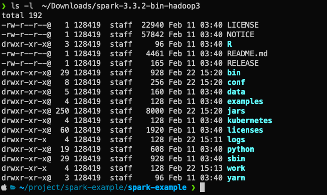
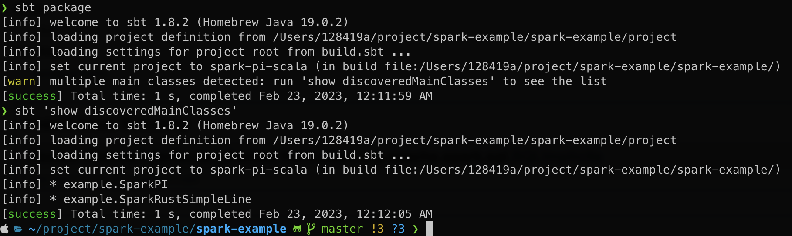
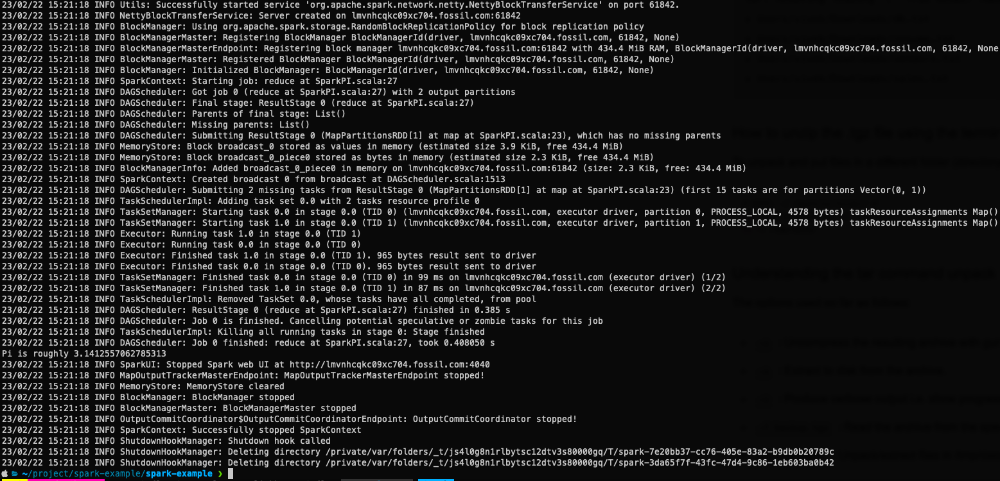
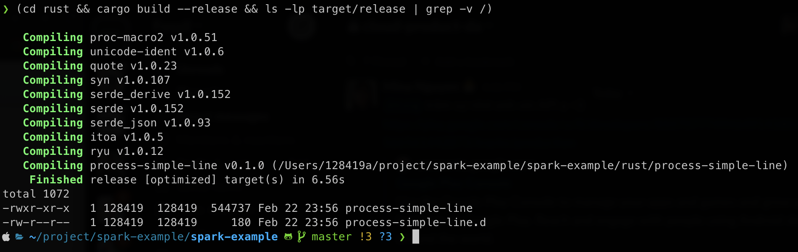
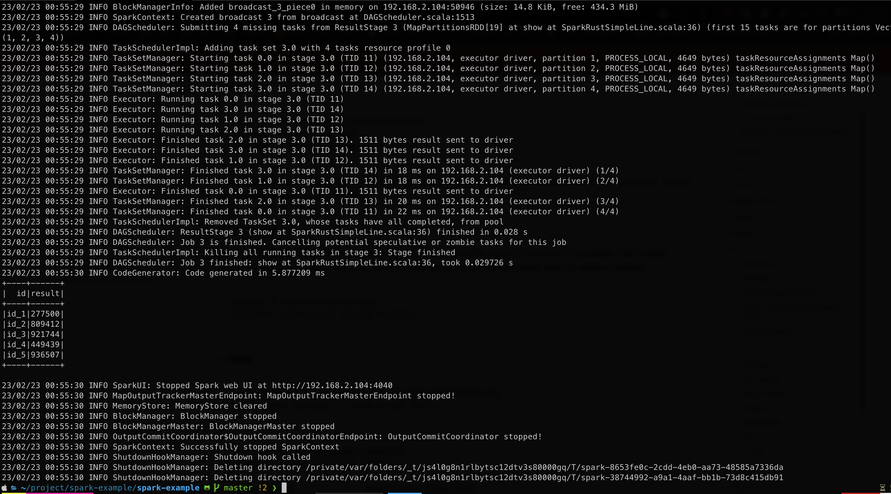

# Table of Contents
- [Prerequisites](#prerequisites)
- [Building Spark Apps](#building-spark-apps)
- [Example 1: Spark Scala](#example-1-spark-scala)
- [Example 2: Spark Scala Calling Rust Binary](#example-2-spark-scala-calling-rust-binary)

# Prerequisites

Make sure you have installed all of the following prerequisites on your development machine:

- Scala + SBT

  ```bash
  brew install sbt
  ```

- Rust and Cargo

  ```bash
  curl https://sh.rustup.rs -sSf | sh
  ```

- Spark

  ```bash
  curl -o ~/Downloads/spark-3.3.2-bin-hadoop3.tgz https://dlcdn.apache.org/spark/spark-3.3.2/spark-3.3.2-bin-hadoop3.tgz
  tar zxvf ~/Downloads/spark-3.3.2-bin-hadoop3.tgz -C ~/Downloads
  ```



# Build Spark Apps

Build all Spark Apps into single .jar file using

```bash
sbt package
```




# Example 1: Spark Scala

Simple SparkPI

```bash
~/Downloads/spark-3.3.2-bin-hadoop3/bin/spark-submit \
  --class "example.SparkPI" \
  --master "local[*]" \
  target/scala-2.12/spark-example_2.12-0.1.0-SNAPSHOT.jar 9999
```



# Example 2: Spark Scala calling Rust binary

1. Build Rust

```bash
(cd rust && cargo build --release && ls -lp target/release | grep -v /)
```

Test the Rust simple pipe processing:

```bash
echo '{"id": "duyet", "a":1, "b": 2}' | ./rust/target/release/process-simple-line
# {"id":"duyet","result":3}
```




2. Submit Spark + Rust as the following:

```bash
~/Downloads/spark-3.3.2-bin-hadoop3/bin/spark-submit \
  --class "example.SparkRustSimpleLine" \
  --master "local[*]" \
  --files rust/target/release/process-simple-line \
  target/scala-2.12/spark-example_2.12-0.1.0-SNAPSHOT.jar
```


